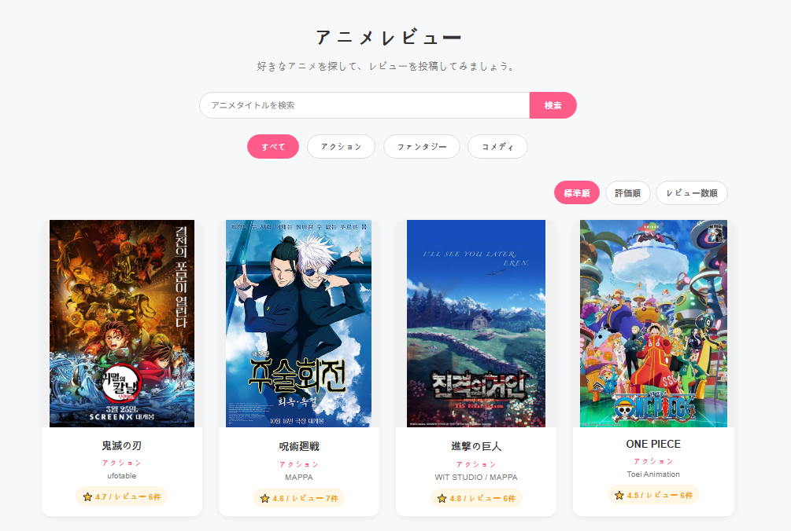
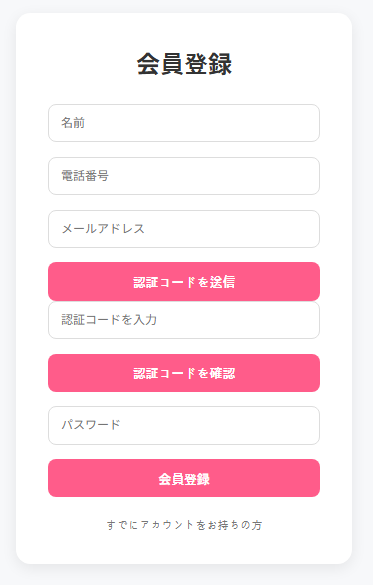
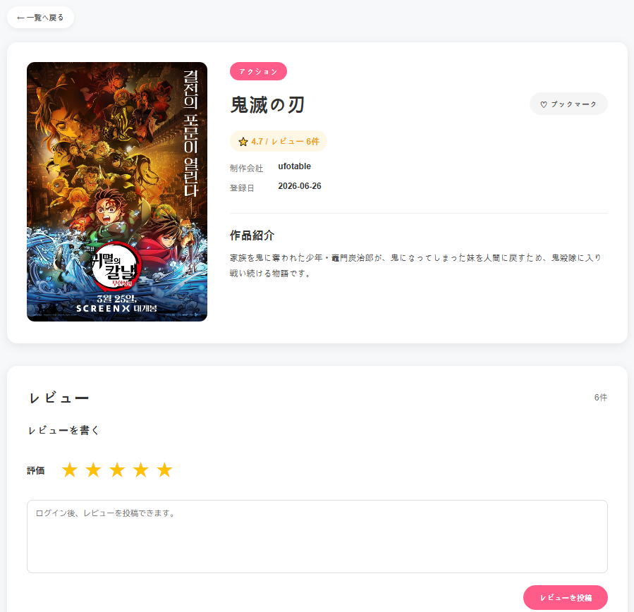
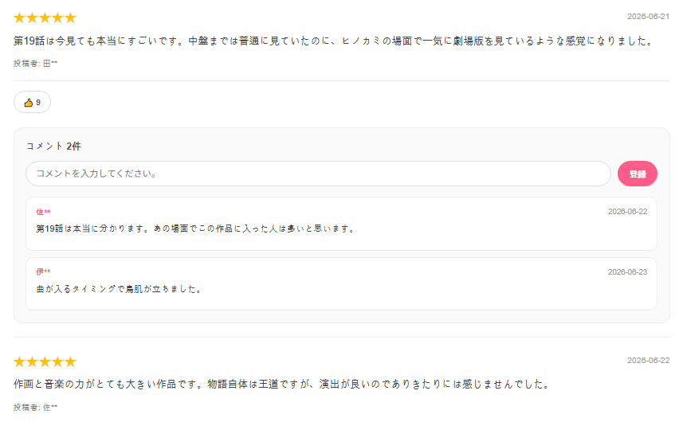
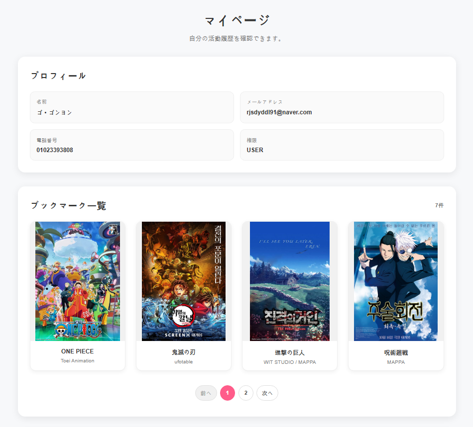
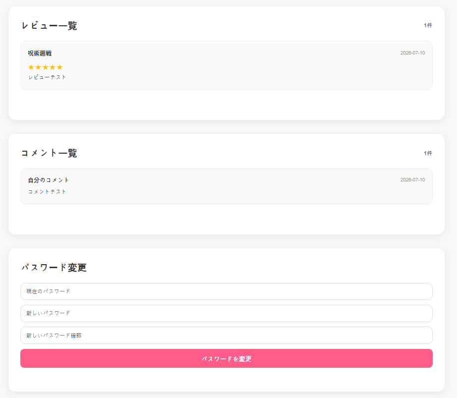
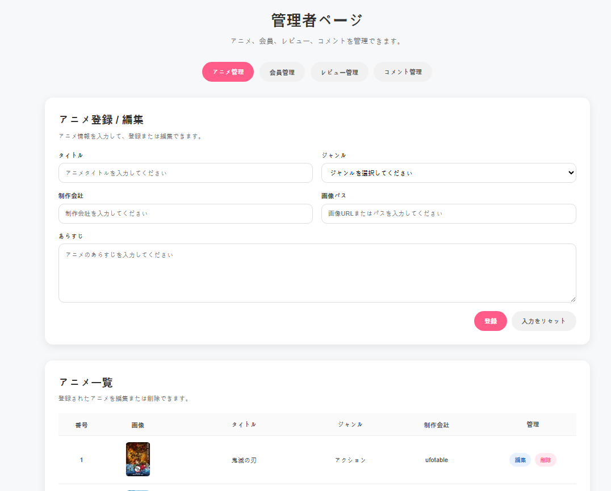

# アニメレビュー Webアプリケーション

## 1. プロジェクト概要

本プロジェクトは、アニメ作品に対してレビュー、コメント、いいね、ブックマークを行えるWebアプリケーションです。  
ユーザーは会員登録・ログイン後、作品に対してレビューを投稿したり、他のユーザーのレビューにコメントやいいねを行うことができます。  
また、管理者は作品、会員、レビュー、コメントを管理できるようにしました。

単なるアニメ紹介サイトではなく、会員認証、投稿機能、管理者機能を含めた一連のWebサービスの流れを学ぶことを目的として開発しました。

---

## 2. 開発目的

Spring Boot、Spring Data JPA、MySQL、JavaScriptを活用し、フロントエンドからバックエンド、データベースまで一連のWebアプリケーション開発を経験することを目的として制作しました。

特に、ログイン状態による機能制御、レビュー・コメント・いいね・ブックマークなど複数テーブルが関連する機能、管理者によるデータ管理機能の実装を通じて、実際のサービスに近い構成を意識しました。

---

## 3. 使用技術

### Backend
- Java
- Spring Boot
- Spring Data JPA
- MySQL

### Frontend
- HTML
- CSS
- JavaScript

### その他
- Gmail SMTP
- Git / GitHub

---

## 4. 主な機能

### ユーザー機能
- 会員登録
- ログイン / ログアウト
- メール認証
- 仮パスワード発行
- アニメ作品一覧表示
- ジャンル別作品表示
- 作品検索
- レビュー投稿 / 修正 / 削除
- コメント投稿 / 削除
- レビューへのいいね
- ブックマーク
- マイページ

### 管理者機能
- 作品管理
- 会員管理
- レビュー管理
- コメント管理

---

## 5. システム構成

本プロジェクトでは、Controller、Service、Repositoryの役割を分けて実装しました。

- Controller：画面またはJavaScriptからのリクエストを受け取る
- Service：ビジネスロジックを処理する
- Repository：データベースとのやり取りを行う

フロントエンドではJavaScriptのfetchを使用してAPIを呼び出し、取得したデータを画面に表示しています。

---

## 6. DB設計

主なテーブルは以下の通りです。

| テーブル名 | 内容 |
|---|---|
| member | 会員情報 |
| genre | ジャンル情報 |
| anime | アニメ作品情報 |
| review | レビュー情報 |
| comment | コメント情報 |
| bookmark | ブックマーク情報 |
| review_like | レビューいいね情報 |

### テーブル関係

- genre 1 : N anime
- member 1 : N review
- anime 1 : N review
- review 1 : N comment
- member 1 : N comment
- member N : M anime（bookmark）
- member N : M review（review_like）

---

## 7. 主要実装内容

### ログイン・権限制御

ログイン成功時にセッションへ会員情報を保存し、レビュー投稿、コメント、ブックマークなど一部のログインが必要な機能はInterceptorで制御しました。  
また、マイページ関連機能ではセッションに保存されたユーザー情報を確認し、管理者機能ではroleがADMINのユーザーのみ利用できるようにしました。

### メール認証・仮パスワード発行

Gmail SMTPを利用し、会員登録時のメール認証機能と、パスワードを忘れた場合の仮パスワード発行機能を実装しました。  
メールアカウント情報やデータベース接続情報などの機密情報は、GitHubに直接公開しないよう、`application.properties`をGit管理対象外にしています。

### レビュー・コメント機能

ログインしたユーザーがアニメ作品に対して星評価付きのレビューを投稿できるようにし、他のユーザーのレビューにコメントを投稿できるようにしました。  
レビューは投稿したユーザー本人のみ修正・削除できるようにし、コメントは投稿したユーザー本人のみ削除できるようにしました。

### 評価集計・並び替え機能

各作品に投稿されたレビューの星評価を集計し、作品ごとの平均評価とレビュー数を表示できるようにしました。  
また、メインページでは平均評価順やレビュー数順に作品を並び替えられるようにしました。

### ブックマーク・いいね機能

ユーザーが気に入ったアニメ作品をブックマークできるようにし、他のユーザーのレビューにいいねを付けられるようにしました。  
同じユーザーが同じ作品やレビューに対して重複して登録しないよう、既存データを確認したうえで追加・解除を行うトグル処理として実装しました。

### ページング処理

レビューや管理データが増えた場合でも一覧を見やすく表示できるように、一覧画面にページング処理を実装しました。  
必要なデータをページ単位で取得することで、一度に大量のデータを表示しない構成にしました。

### 管理者機能

管理者はアニメ作品、会員、レビュー、コメントを管理できるようにしました。  
アニメ作品の登録・修正時には画像URLを入力し、作品画像を画面に表示できるようにしました。  
一般ユーザーと管理者の役割を分けることで、実際のWebサービスに近い権限設計を意識しました。

---

## 8. 苦労した点・工夫した点

### ログイン状態による機能制御

レビュー投稿、コメント、ブックマークなど、ログインが必要な機能が複数あったため、最初は各Controllerで個別に確認する方法も考えました。  
しかし、同じ処理が重複してしまうため、Interceptorを利用して共通的にログインチェックを行うようにしました。  
また、管理者機能ではセッションに保存されたユーザーのroleを確認し、一般ユーザーが管理機能を利用できないようにしました。

### 複数テーブルの関連設計

レビュー、コメント、いいね、ブックマークなど複数のテーブルが関連するため、どのテーブルにmemberId、animeId、reviewIdを持たせるかを意識して設計しました。  
例えば、コメントは特定のレビューに紐づくためreviewIdを持たせ、いいねはユーザーとレビューの関係を管理するためreview_likeテーブルで管理しました。  
このように、画面に必要な機能から逆算してテーブル間の関係を整理した点を工夫しました。

---

## 9. 今後の改善点

* 現在の画像URL登録方式から、画像ファイルを直接アップロードできる方式への改善
* 管理者が予告編動画のURLを登録し、作品詳細ページで動画を再生できる機能の追加
* 現在のSession・Interceptor方式から、Spring Securityを利用したより安全で体系的な認証・認可方式への改善
* ブックマークやレビューへのいいねについて、データベース側の一意制約を追加し、より安全に重複登録を防ぐ設計への改善

---

## 10. 画面

### メインページ
アニメ作品の一覧を表示し、タイトル検索、ジャンル別表示、評価順・レビュー数順の並び替えができます。

### 会員登録ページ
名前、電話番号、メールアドレス、パスワードを入力して会員登録できます。  
登録前にメール認証コードを送信・確認することで、実際に利用可能なメールアドレスか確認できるようにしました。

### 詳細ページ
作品情報、平均評価、レビュー数、ブックマーク機能を確認できます。  
ログイン後は作品に対して星評価付きのレビューを投稿できます。

### レビュー・コメント
投稿されたレビューに対して、いいねやコメントを行うことができます。  
レビューごとにコメント一覧を表示し、ユーザー同士が感想を共有できるようにしました。

### マイページ
プロフィール情報、ブックマークした作品、自分が投稿したレビュー・コメントを確認できます。  
また、ログイン中のユーザーはマイページからパスワード変更も行えます。

### 管理者ページ
管理者はアニメ作品、会員、レビュー、コメントを管理できます。  
一般ユーザーと管理者の権限を分けることで、実際のWebサービスに近い管理機能を意識しました。

